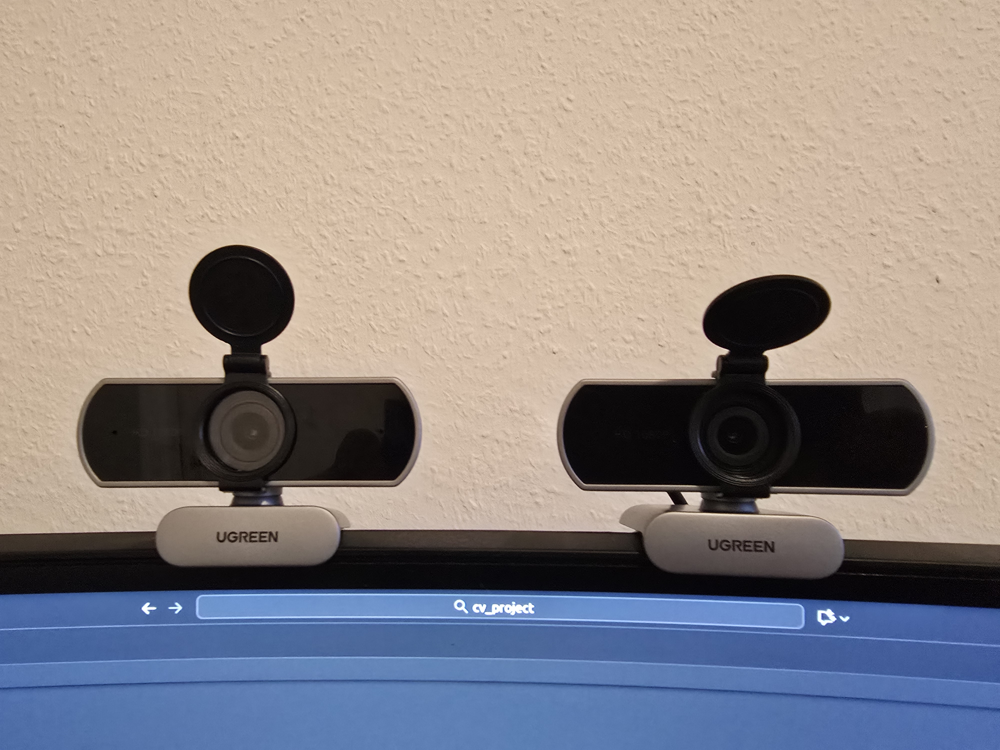

# Stereo Vision ROS2

A complete stereo vision system for 3D reconstruction and depth estimation using dual USB cameras, OpenCV, and ROS2 integration.

[](LICENSE)
[](https://www.python.org/)
[](https://docs.ros.org/)
[](https://opencv.org/)

##  Table of Contents

- [Overview](#overview)
- [Features](#features)
- [System Requirements](#system-requirements)
- [Installation](#installation)
- [Project Structure](#project-structure)
- [Quick Start Guide](#quick-start-guide)
- [Stereo Calibration](#stereo-calibration)
- [Depth Estimation](#depth-estimation)
- [3D Point Cloud Visualization](#3d-point-cloud-visualization)
- [ROS2 Integration](#ros2-integration)
- [Technical Specifications](#technical-specifications)
- [Troubleshooting](#troubleshooting)
- [Contributing](#contributing)
- [License](#license)

## Overview

This project implements a complete stereo vision pipeline for real-time 3D reconstruction using two USB webcams. It includes camera calibration, stereo rectification, disparity mapping using Semi-Global Block Matching (SGBM), and 3D point cloud generation with RGB coloring.

### Key Capabilities

- **Stereo Camera Calibration**: Automated calibration using checkerboard patterns
- **Real-time Depth Estimation**: SGBM with WLS filtering for high-quality disparity maps
- **3D Point Cloud Generation**: Colored point clouds with Open3D visualization
- **ROS2 Integration**: Publishes PointCloud2 messages for RViz visualization
- **Interactive Depth Measurement**: Click-to-measure depth functionality

##  Features

### Calibration Tools
-  Automatic stereo calibration with checkerboard detection
-  Manual and auto-capture modes for calibration images
-  Reprojection error analysis (achieved: **0.57 pixels**)
-  YAML export of calibration parameters

### Depth Estimation
-  **75% depth map coverage** with optimized parameters
-  SGBM (Semi-Global Block Matching) stereo matching
-  WLS (Weighted Least Squares) filtering for edge-aware smoothing
-  CLAHE (Contrast Limited Adaptive Histogram Equalization) preprocessing
-  Real-time disparity visualization with JET colormap

### 3D Visualization
-  Colored point cloud generation from stereo images
-  Open3D integration for interactive 3D viewing
-  PLY file export for external processing
-  Coordinate frame visualization
-  Mouse-click depth measurement

### ROS2 Integration
-  PointCloud2 publisher for RViz visualization
-  Rectified image and disparity map topics
-  Configurable camera parameters via ROS2 params
-  ~30 FPS real-time performance

## 🖥️ System Requirements

### Hardware
- **Cameras**: 2x USB webcams (tested with 640x480 resolution)
- **Baseline**: ~115mm between camera centers (measured: **114.79mm**)
- **RAM**: 4GB minimum, 8GB recommended
- **OS**: Ubuntu 20.04+ (tested on Ubuntu 22.04)


*Our stereo camera rig: Two UGREEN USB webcams mounted with ~115mm baseline separation*

### Software
- **Python**: 3.8 or higher
- **ROS2**: Humble Hawksbill or later (optional, for ROS2 features)
- **OpenCV**: 4.5+ with contrib modules (ximgproc for WLS filtering)
- **Open3D**: 0.13+ for 3D visualization
- **NumPy**: 1.19+

##  Installation

### 1. Install System Dependencies

```bash
# Update system packages
sudo apt update && sudo apt upgrade -y

# Install Python and pip
sudo apt install python3 python3-pip -y

# Install OpenCV dependencies
sudo apt install libopencv-dev python3-opencv -y

# Install v4l-utils (for camera debugging)
sudo apt install v4l-utils -y
```

### 2. Install Python Packages

```bash
# Install core dependencies
pip3 install opencv-contrib-python numpy pyyaml

# Install Open3D for 3D visualization
pip3 install open3d

# Install matplotlib for plotting
pip3 install matplotlib
```

### 3. Install ROS2 (Optional - for ROS2 features)

```bash
# Install ROS2 Humble (Ubuntu 22.04)
sudo apt install ros-humble-desktop -y

# Install ROS2 Python dependencies
pip3 install sensor_msgs_py

# Install cv_bridge
sudo apt install ros-humble-cv-bridge -y
```

### 4. Clone the Repository

```bash
# Clone the project
git clone https://github.com/Sourav0607/Stereo_Vision_ROS2.git
cd Stereo_Vision_ROS2

# Create calibration results directory
mkdir -p ~/stereo_calib_results
```

##  Project Structure

```
Stereo_Vision_ROS2/
│
├── README.md                          # This file
├── .gitignore                         # Git ignore rules
│
├── stereo_vision/                     # Core stereo vision scripts
│   ├── stereo_calibrate.py           # Manual stereo calibration
│   ├── stereo_calibration_auto_capture.py  # Auto-capture calibration
│   ├── point_cloud_3d.py             # 3D point cloud visualization
│   ├── depth_map_wsl.py              # Depth map with WLS filtering
│   ├── depth_trial_without_wsl.py    # Basic depth map (no WLS)
│   ├── rectification_test.py         # Rectification verification
│   ├── verify_usbport_cameraL.py     # Left camera USB detection
│   └── verify_usbport_cameraR.py     # Right camera USB detection
│
├── cam_ros_node/                      # ROS2 integration package
│   └── cam_ros_node/
│       ├── setup.py                   # ROS2 package configuration
│       ├── package.xml                # ROS2 package manifest
│       └── cam_ros_node/
│           ├── cam_ros_node.py       # Camera image publisher
│           └── stereo_pointcloud_node.py  # Point cloud publisher
│
└── Visualisation_outputs/             # Sample outputs and results
    ├── point_cloud_*.ply             # Saved point cloud files
    └── calibration_images/           # Calibration image captures
```

##  Quick Start Guide

### Step 1: Verify Camera Connections

```bash
# List available video devices
ls /dev/video*

# Test left camera (adjust index if needed)
python3 stereo_vision/verify_usbport_cameraL.py

# Test right camera
python3 stereo_vision/verify_usbport_cameraR.py
```

**Expected Output**: Live video feed from each camera. Press 'q' to exit.

### Step 2: Perform Stereo Calibration

####  Auto Capture Mode (After every 3 seconds)

```bash
cd stereo_vision
python3 stereo_calibrate_auto capture.py
```

####  Calibration of Camera

```bash
python3 stereo_calibration.py
```
**Calibration Results**: Saved to `~/stereo_calib_results/`
- `left.yaml` - Left camera intrinsics (K, D)
- `right.yaml` - Right camera intrinsics (K, D)
- `stereo.yaml` - Stereo extrinsics (R, T, baseline)

### Step 3: Generate 3D Point Cloud

```bash
python3 stereo_vision/point_cloud_3d.py
```

**Controls**:
- **Click on image**: Display 3D coordinates and depth at pixel
- **SPACE**: Open Open3D viewer with colored point cloud
- **ESC**: Exit application

**Mouse Controls in Open3D**:
- **Left drag**: Rotate view
- **Right drag**: Pan view
- **Scroll**: Zoom in/out
- **R**: Reset view

##  Stereo Calibration

### Checkerboard Specifications

Our calibration uses:
- **Pattern**: 8×6 internal corners (9×7 squares)
- **Square Size**: 30mm × 30mm
- **Material**: Printed on flat, rigid surface

### Calibration Quality Metrics

| Metric | Value | Status |
|--------|-------|--------|
| Reprojection Error | 0.5737 pixels |  Excellent |
| Baseline Distance | 114.79 mm |  Measured |
| Focal Length | 1013.87 pixels | Calibrated |
| Coverage | 75% |  High |

**Reprojection Error Interpretation**:
- < 0.5 pixels: Excellent
- 0.5-1.0 pixels: Good (our result: **0.57**)
- 1.0-2.0 pixels: Acceptable
- \> 2.0 pixels: Poor, recalibrate

### Calibration Tips

1. **Lighting**: Use uniform, diffuse lighting (avoid shadows and glare)
2. **Coverage**: Capture images with checkerboard at:
   - Different depths (near and far)
   - Different angles (tilted, rotated)
   - All corners of the field of view
3. **Focus**: Ensure both cameras are in focus
4. **Stability**: Keep cameras rigidly mounted during capture
5. **Quantity**: Capture 20-30 image pairs for robust calibration

##  Depth Estimation

> ⚠️ **Note**: Depth estimation accuracy is currently under active improvement. While the system provides reasonable depth maps with 75% coverage, absolute depth measurements may have variations of ±5-10% in the working range. This is an ongoing task being refined through better calibration techniques and parameter optimization.

### Depth Formula

Our system uses the standard stereo vision equation:

```
Z = (focal_length × baseline) / disparity
Z = (1013.87 px × 114.79 mm) / disparity
Z ≈ 116,379 / disparity (in mm)
```

**Example Calculations**:
- Disparity = 50 pixels → Depth = 2.33 m
- Disparity = 100 pixels → Depth = 1.16 m
- Disparity = 10 pixels → Depth = 11.64 m (unreliable)

**Current Limitations** (Work in Progress):
- Depth accuracy decreases at distances > 5m
- Small disparities (< 5 pixels) are filtered as unreliable
- Textureless surfaces may produce inaccurate depth values
- Edge regions may have depth bleeding artifacts

### Disparity Range

- **Minimum Reliable Disparity**: 5 pixels
- **Maximum Disparity Search**: 160 pixels
- **Depth Range**: ~0.7m to ~10m
- **Optimal Range**: 1m to 5m

### SGBM Parameters

Our optimized SGBM parameters for 75% coverage:

```python
minDisparity = 0              # Start of disparity search
numDisparities = 160          # Range of disparity search (must be ÷16)
blockSize = 7                 # Matching window size (odd number)
P1 = 8 × 3 × blockSize²      # Small disparity smoothness penalty
P2 = 32 × 3 × blockSize²     # Large disparity smoothness penalty
uniquenessRatio = 8          # Match confidence threshold
speckleWindowSize = 80       # Speckle filter window
speckleRange = 2             # Max disparity in speckle region
```

### WLS Filtering

WLS (Weighted Least Squares) post-processing improves disparity quality:

```python
lambda = 8000.0              # Smoothness (higher = smoother)
sigma_color = 1.5            # Edge sensitivity (lower = sharper edges)
```

**Benefits**:
- Removes noise and artifacts
- Preserves depth discontinuities at object edges
- Fills small holes in disparity map
- Improves overall accuracy

##  3D Point Cloud Visualization

### Point Cloud Generation Pipeline

1. **Rectify Images**: Align epipolar lines horizontally
2. **Compute Disparity**: SGBM matching + WLS filtering
3. **3D Reprojection**: Use Q matrix to convert disparity → 3D
4. **Color Mapping**: Extract RGB from rectified left image
5. **Filtering**: Remove invalid points (no disparity, non-finite depth)

### Q Matrix Reprojection

The Q matrix transforms 2D disparity to 3D coordinates:

```
[X]       [x]
[Y]   = Q [y]
[Z]       [d]
[W]       [1]
```

Then normalize: `(X/W, Y/W, Z/W)` → final 3D point

##  ROS2 Integration

### Building the ROS2 Package

```bash
# Navigate to workspace
cd ~/Stereo_Vision_ROS2

# Source ROS2
source /opt/ros/humble/setup.bash

# Build the package
colcon build --packages-select cam_ros_node

# Source the workspace
source install/setup.bash
```

### Running ROS2 Nodes

#### 1. Camera Image Publisher

```bash
ros2 run cam_ros_node cam_ros_node
```

**Published Topics**:
- `/camera/left/image_raw` - Left camera BGR images
- `/camera/right/image_raw` - Right camera BGR images

#### 2. Stereo Point Cloud Publisher

```bash
ros2 run cam_ros_node stereo_pointcloud_node
```

**Published Topics**:
- `/stereo/points` - PointCloud2 (colored 3D points)
- `/camera/left/image_rect` - Rectified left image
- `/stereo/disparity` - Disparity map (mono16)

**Parameters**:
```bash
# Change camera indices
ros2 run cam_ros_node stereo_pointcloud_node --ros-args \
  -p left_index:=2 -p right_index:=0

# Change resolution
ros2 run cam_ros_node stereo_pointcloud_node --ros-args \
  -p width:=1280 -p height:=720

# Change TF frame
ros2 run cam_ros_node stereo_pointcloud_node --ros-args \
  -p frame_id:="camera_optical_frame"
```

### Visualizing in RViz

```bash
# Launch RViz
rviz2

# In RViz:
# 1. Set Fixed Frame to: "base_link"
# 2. Add → PointCloud2
# 3. Set Topic to: /stereo/points
# 4. Set Color Transformer to: RGB8
# 5. Adjust point size as needed
# 6. Invert Z-axis
```

### ROS2 Topic Information

```bash
# List all topics
ros2 topic list

# Check topic info
ros2 topic info /stereo/points

# View point cloud data
ros2 topic echo /stereo/points

# Check publishing rate
ros2 topic hz /stereo/points
```

**Expected Rate**: ~30 Hz

##  Technical Specifications

### Camera Setup

| Parameter | Value | Unit |
|-----------|-------|------|
| Left Camera Index | 0 or 2 | - |
| Right Camera Index | 2 or 0 | - |
| Resolution | 640 × 480 | pixels |
| Frame Rate | ~30 | FPS |
| Baseline | 114.79 | mm |
| Focal Length | 1013.87 | pixels |

### Calibration Parameters

| Parameter | Left Camera | Right Camera |
|-----------|-------------|--------------|
| fx (focal length X) | ~1013 px | ~1013 px |
| fy (focal length Y) | ~1013 px | ~1013 px |
| cx (principal point X) | ~320 px | ~320 px |
| cy (principal point Y) | ~240 px | ~240 px |
| k1 (radial distortion) | ~-0.3 | ~-0.3 |

### Performance Metrics

| Metric | Value | Notes |
|--------|-------|-------|
| Depth Map Coverage | 75% | With CLAHE + WLS |
| Reprojection Error | 0.57 pixels | Calibration quality |
| Processing Time | ~33 ms | Per frame (30 FPS) |
| Depth Accuracy | ±5-10% | At 1-3m range (⚠️ under improvement) |
| Depth Range | 0.7-10 m | Reliable range |

### Algorithm Components

- **Stereo Matching**: Semi-Global Block Matching (SGBM)
- **Post-Processing**: Weighted Least Squares (WLS) filtering
- **Preprocessing**: CLAHE (Contrast Limited AHE)
- **3D Reprojection**: Q matrix transformation
- **Coordinate Frame**: Left camera optical center

##  Troubleshooting

### Issue: Cameras Not Detected

**Symptoms**: "Failed to open one or both cameras" error

**Solutions**:
```bash
# 1. List video devices
ls /dev/video*

# 2. Check camera details
v4l2-ctl --list-devices

# 3. Test camera
ffplay /dev/video0

# 4. Update camera indices in code
# Edit camera IDs in Python scripts (VideoCapture(0) or VideoCapture(2))
```

### Issue: Low Depth Map Coverage (<50%)

**Symptoms**: Mostly black disparity map, few valid points

**Solutions**:
1. **Improve Lighting**: Use uniform, bright lighting
2. **Add Texture**: Point cameras at textured surfaces (not blank walls)
3. **Adjust Parameters**: Increase `uniquenessRatio`, decrease `blockSize`
4. **Enable WLS**: Ensure opencv-contrib-python is installed
5. **Enable CLAHE**: Enhances local contrast

### Issue: Incorrect Depth Values

**Symptoms**: Depth shows kilometers instead of meters

**Solutions**:
```python
# Check Q matrix units - may output mm instead of m
# Add conversion:
if z_median > 20.0:  # Likely millimeters
    depth_m = depth_mm / 1000.0
```

### Issue: Checkerboard Not Detected

**Symptoms**: Calibration cannot find pattern

**Solutions**:
1. **Verify Pattern Size**: Must be 8×6 internal corners
2. **Improve Lighting**: Avoid shadows and glare
3. **Check Focus**: Ensure cameras are in focus
4. **Flat Surface**: Print on rigid, flat surface
5. **Adjust Threshold**: Modify detection parameters if needed

### Issue: Point Cloud in Wrong Units

**Symptoms**: Point cloud extremely large or small

**Solutions**:
```python
# Auto-detect units in code
z_med = np.median(np.abs(Z))
units = 'mm' if z_med > 20.0 else 'm'

# Apply conversion if needed
if units == 'mm':
    points = points / 1000.0  # Convert to meters
```

### Issue: ROS2 Node Not Found

**Symptoms**: `ros2 run cam_ros_node` command fails

**Solutions**:
```bash
# 1. Rebuild package
cd ~/cam_ros_node
colcon build --packages-select cam_ros_node

# 2. Source workspace
source install/setup.bash

# 3. Verify node exists
ros2 pkg executables cam_ros_node

# 4. Check setup.py entry points
cat cam_ros_node/setup.py
```

### Issue: Poor Stereo Matching

**Symptoms**: Noisy disparity map, incorrect depths

**Solutions**:
1. **Recalibrate**: Achieve < 1.0 pixel reprojection error
2. **Check Rectification**: Epipolar lines should be horizontal
3. **Adjust SGBM**: Tune `P1`, `P2`, `uniquenessRatio`
4. **Enable WLS**: Significantly improves quality
5. **Add Texture**: Point at objects with visible texture

##  Additional Resources

### Documentation
- [OpenCV Stereo Calibration](https://docs.opencv.org/4.x/d9/d0c/group__calib3d.html)
- [SGBM Algorithm](https://docs.opencv.org/4.x/d2/d85/classcv_1_1StereoSGBM.html)
- [Open3D Point Cloud](http://www.open3d.org/docs/release/tutorial/geometry/pointcloud.html)
- [ROS2 Humble Docs](https://docs.ros.org/en/humble/)


### Tools
- **Meshlab**: Point cloud visualization and processing
- **CloudCompare**: Advanced point cloud analysis
- **RViz**: ROS visualization tool
- **rqt**: ROS2 GUI tools

##  Contributing

Contributions are welcome! 


### Code Style
- Followed Python code
- Add docstrings to all functions
- Include comments for complex algorithms
- Test your changes before submitting

##  License

This project is licensed under the MIT License - see the [LICENSE](LICENSE) file for details.

##  Author

**Sourav**
- GitHub: [@Sourav0607](https://github.com/Sourav0607)
- Repository: [Stereo_Vision_ROS2](https://github.com/Sourav0607/Stereo_Vision_ROS2)

##  Acknowledgments

- OpenCV community for excellent computer vision libraries
- Open3D developers for 3D visualization tools
- ROS2 community for robotics middleware
- Stereo vision research community

##  Project Status

**Status**:  Active Development

**Completed Features**:
-  Stereo camera calibration (manual and auto-capture modes)
-  Real-time depth map generation with SGBM
-  WLS (Weighted Least Squares) filtering for disparity refinement
-  Achieved 75% depth map coverage
-  3D point cloud visualization with Open3D
-  Interactive mouse-click depth measurement
-  ROS2 camera image publisher node
-  ROS2 stereo point cloud publisher node with PointCloud2 messages
-  RViz visualization support
-  Comprehensive code comments

**Future Work** (Not Yet Completed):
- [ ]  **Improve depth estimation accuracy** (ongoing priority)
  - Fine-tune calibration process
  - Implement depth-disparity validation
  - Add ground truth measurements for calibration
- [ ] Implement YOLO object detection and human pose estimtion

---

**Happy Stereo Vision!**

For questions or issues, please write me to sourav.hawaldar@gmail.com
